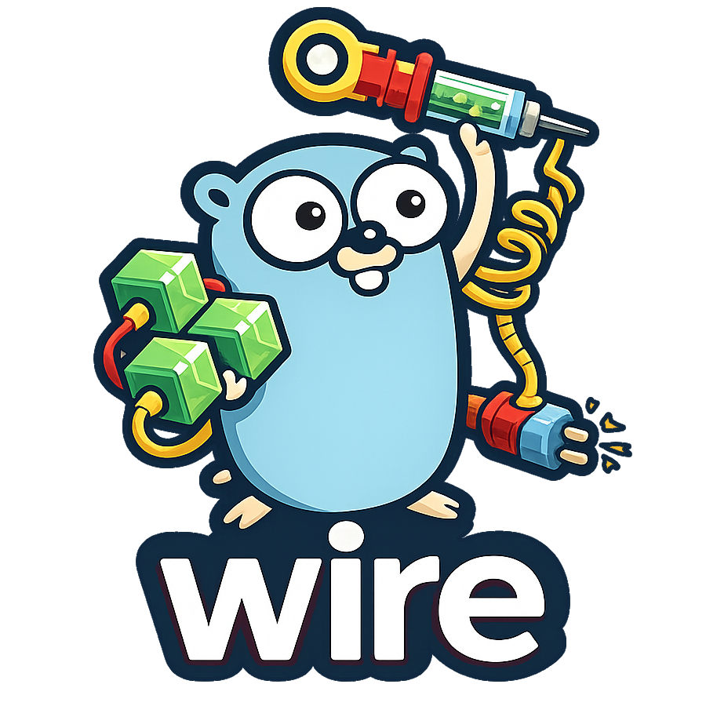

<p align="center">
  
</p>

<p align="center">
    Compile-time dependency injection for Go - fast, explicit, and reflection-free.
</p>

<p align="center">
    <a href="https://pkg.go.dev/github.com/goforj/wire"></a>
    <a href="LICENSE"></a>
    <a href="https://github.com/goforj/wire/actions"></a>
    <a href="https://golang.org"></a>
    
    <a href="https://codecov.io/gh/goforj/wire" ></a>
    <a href="https://goreportcard.com/report/github.com/goforj/wire"></a>
</p>

<p align="center">
  <code>wire</code> generates plain Go code to wire your application together.
  No runtime container, no reflection, no hidden magic - just fast, explicit initialization.
</p>

> [!NOTE]
> This is a maintained fork of `google/wire`.
> The original project is no longer actively maintained.
> This fork preserves Wire’s API and behavior while focusing on:
>
> - Faster compile times via caching
> - Improved generator determinism
> - Better documentation and developer ergonomics
>
> Existing Wire codebases should work without modification.

Wire is a code generation tool that automates connecting components using
[dependency injection][]. Dependencies between components are represented in
Wire as function parameters, encouraging explicit initialization instead of
global variables. Because Wire operates without runtime state or reflection,
code written to be used with Wire is useful even for hand-written
initialization.

For an overview, see the [introductory blog post](https://blog.golang.org/wire).

[dependency injection]: https://en.wikipedia.org/wiki/Dependency_injection
[godoc]: https://godoc.org/github.com/goforj/wire

## Installing

```sh
go install github.com/goforj/wire/cmd/wire@latest
```

Ensure `$GOPATH/bin` is in your `$PATH`.

## Compatibility with google/wire

Wire remains compatible with codebases that import `github.com/google/wire`.
The generator emits a `//go:generate` directive pointing at this fork so
`go generate` consistently uses the maintained toolchain.

To keep existing imports unchanged:

```sh
go mod edit -replace=github.com/google/wire=github.com/goforj/wire@latest
```

## How Wire Works (in 60 seconds)

Wire is a **compile-time dependency injection** tool. Instead of building a runtime
container, Wire generates ordinary Go code that explicitly initializes your
application.

There are only two concepts to learn:

### Providers

A provider is a normal Go function that produces a value (and optionally an error).

```go
func NewDB(cfg Config) (*sql.DB, error) {
    // ...
}
````

Dependencies are expressed as function parameters - no globals, no hidden state.

### Injectors

An injector is a stub function whose body calls `wire.Build(...)`.
Wire replaces this stub with generated code that calls providers in dependency
order.

```go
func InitializeApp(cfg Config) (*App, error) {
    wire.Build(AppSet)
    return nil, nil
}
```

The generated output is plain Go - readable, debuggable, and fast.

## Minimal Example

```go
// providers.go
type Message string

func ProvideMessage() Message {
    return "hello wire"
}

type Greeter struct {
    Msg Message
}

func NewGreeter(msg Message) *Greeter {
    return &Greeter{Msg: msg}
}

var GreeterSet = wire.NewSet(
    ProvideMessage,
    NewGreeter,
)
```

```go
// wire.go
//go:build wireinject

func InitializeGreeter() *Greeter {
    wire.Build(GreeterSet)
    return nil
}
```

Generate the injector:

```sh
wire
```

Wire produces `wire_gen.go` containing explicit initialization code with no
runtime dependency on Wire.

## Design Guidance

Wire favors explicitness and long-term maintainability:

* Prefer **small provider sets**, especially in libraries
* Avoid injecting common types like `string`; define distinct types instead
* Treat provider sets as **public APIs** with compatibility guarantees
* Use struct providers and interface bindings to keep graphs readable

For detailed guidance, see **Best Practices**.

## Documentation

If you're new to Wire, we recommend reading in this order:

1. **Tutorial** - A guided introduction with a complete working example
2. **User Guide** - Full reference for providers, injectors, bindings, and advanced patterns
3. **Best Practices** - Design guidance for large codebases and libraries
4. **FAQ** - Design rationale and common questions

* [Tutorial](./_tutorial/README.md)
* [User Guide](./docs/guide.md)
* [Best Practices](./docs/best-practices.md)
* [FAQ](./docs/faq.md)

## When Not to Use Wire

Wire is designed for medium-to-large Go applications with non-trivial
initialization logic.

For small programs with only a handful of dependencies, hand-written
initialization is often simpler and clearer.

## Project Status

This fork tracks the original Wire feature set while prioritizing performance,
determinism, and documentation. Compatibility with existing Wire codebases is a
core goal.

## Community

For questions and discussion, use
[GitHub Discussions](https://github.com/goforj/wire/discussions).

This project follows the Go
[Code of Conduct](./CODE_OF_CONDUCT.md).

